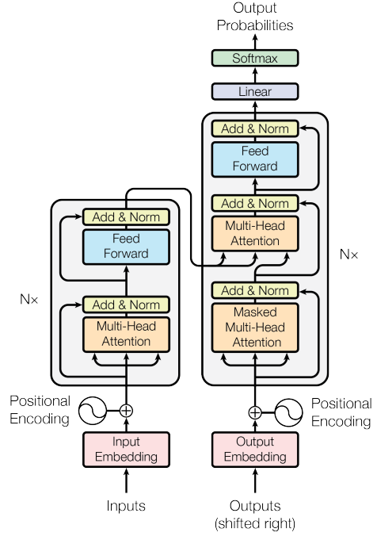

# Chatbot Based on Deep Neural Networks

**Author**: Vladyslav Malashchuk  
**Faculty**: Brno University of Technology (VUT), Faculty of Information Technology (FIT)  
**Thesis Title**: Chatbot Based on Deep Neural Networks  

# Table of Contents

- [Introduction](#introduction)
- [Installation](#installation)
- [Using](#using)
   - [Hyperparams and Configuration](#hyperparams-and-configuration)
   - [Training](#training)
   - [Chatting](#chatting)
- [Language and Framework](#language-and-framework)
  - [Additional Libraries](#additional-libraries)
- [Architecture](#architecture)
   - [Retrieval-Based](#retrieval-based)
   - [Transformer](#transformer)

- [Training Validation]()
- [Metrics](#metrics)
- [LICENSE](#license)
- [REFERENCES](#references)
## Introduction 

This is an **Introduction** to my Bachelor's project. My task in this work was to write a chatbot based on deep neural networks. Open sources, as well as articles, documentation for the frameworks used, etc. were used in writing the work. My goal was to write a chat bot, which resulted in writing several different ones at once on different architectures, with varying degrees of complexity and productivity. As a result, it was decided to stay with 2 types, the simplest and fastest, and at the moment of writing this work, the newest and most effective chat bot based on the **Transformer Architecture** [[1]](https://proceedings.neurips.cc/paper/2017/file/3f5ee243547dee91fbd053c1c4a845aa-Paper.pdf), for example first of chat-bots on this architecrute was BERT [[2]](https://aclanthology.org/N19-1423/), in 2025 year most of peeople know Chat-Gpt, Deepseek they are very popular in this century, you can freely find them in web and free try.


A detailed description of the theory, discussions of these different architectures, metrics, testing with people can be found in my text work, it describes everything that is needed even for a person who has never worked with Machine Learning or AI. In my thesis I describe in detail from the theory of machine learning to creating chatbots, how they work and testing them. You can find the text and my bachelor's thesis at this link [[2]](https://www.vut.cz/en/students/final-thesis/detail/164616)

This document will not discuss or explain the theory, but will strictly describe the tools used in writing the project and their application in it.

I will start with a short list where I will describe the language used, framework, tokenizer, additional libraries used in the project. Do not expect to fully understand the work of the project after reading this small file, you will understand the technical side, in order to understand what chatbots are, their essence and how they work "in words" without technical reasoning, I advise you to read my thesis, the link is above.


## Installation  
1. Clone the repository:  
   ```bash
   git clone https://github.com/Vlad6422/BP_Transformer_PyTorch.git
   ```  
2. Install dependencies:  
   ```bash
   pip install -r requirements.txt
   ```  
Everyone has different devices, so it is impossible to predict everything exactly, but the project does not use non-standard operating systems or programming languages, etc. Therefore, the project must work on Windows, it was tested on Windows 10 and 11, at least Python must be installed, optionally CUDA [[3]](https://developer.nvidia.com/cuda-toolkit) from Nvidia to speed up training. The remaining libraries are installed either with the help of the script described above. Or manually if necessary. Creating a virtual environment for such tasks is unnecessary and an additional layer greatly slows down training, and this was not part of my assignment.

All training and launch were carried out on my personal laptop with Windows 11 operating system and RTX 3050 ti.

## Using
This section will cover how to use the program. From training and setup to starting communication.

### Hyperparams and Configuration
In the directory with each model you will find a **config.json** file, depending on the model you choose, its hyperparameters differ. The path to the dataset and where to save the model are also set in json. Arguments when running a python file can only be selected when chatting. This approach was chosen because when testing the application I often changed datasets and settings and often forgot to write arguments directly in the console when training, so it was chosen that for training everything would be stored in .json format so that it would be convenient to make a preset for training.
### Training
Section on how to set up and launch training. Below you will see what the **config.json** for each model looks like. Before starting training, I advise you to customize them for yourself and your needs. You can run training via `python3 ./train.py`. After training, you will receive the model itself, text training results with metrics, loss, as well as graphs, etc.
#### Retrieval-Based Config

```json
{
  "num_epochs": "Number of times the entire training dataset is passed through the model",
  "batch_size": "Number of training samples used in one iteration",
  "learning_rate": "Step size for updating model weights",
  "hidden_size": "Number of units in hidden layers",
  "train_split": "Proportion of data used for training vs validation",
  "early_stopping": {
    "patience": "Number of epochs to wait before stopping training if no improvement"
  },
  "dataset_path": "Path to the input dataset",
  "save_model_path": "Path where the trained model will be saved"
}
```
#### Transformer Config
```json
{
  "vocab_size": "Number of unique tokens in the vocabulary",
  "d_model": "Size of the embedding dimension",
  "nhead": "Number of attention heads",
  "num_encoder_layers": "Number of transformer encoder layers",
  "num_decoder_layers": "Number of transformer decoder layers",
  "dim_feedforward": "Dimension of the feedforward network",
  "max_seq_length": "Maximum length of input/output sequences",
  "dropout": "Dropout probability for regularization",
  "batch_size": "Number of training samples used in one iteration",
  "learning_rate": "Step size for updating model weights",
  "num_epochs": "Number of times the entire training dataset is passed through the model",
  "device": "Hardware used for training: 'cuda' for GPU, 'cpu' otherwise",
  "dataset_path": "Path to the input dataset",
  "save_model_path": "Path where the trained model will be saved"
}
```

### Chatting
The chat is launched via `python3 ./chat.py`. It pulls in information about hyperparameters and the model to launch from **config.json**, so everything there should be configured for the model you are going to launch. After that, you can safely write to the console. For the Transformer model, you can also launch a more lively chat using `python3 ./life_chat.py [--temperature] [--top_k] [--config]`. It has the following console arguments:
```
--temperature: (float, default=1.4) – Controls the randomness of the text generation. Higher values produce more diverse outputs.

--top_k: (int, default=3) – Limits sampling to the top K most probable next tokens. Set to 0 to disable top-k sampling.

--config: (str, default="config.json") – Path to the configuration file specifying model and hyperparameters. You can create your own custom config and use 1 config for training, another to chat.
```

## Language and Framework

The project was written in Python 3.11.9 [[4]](python.org/downloads/release/python-3119/) and PyTorch 2.4.1+cu124 [[5]](https://pytorch.org/). These are the main tools used in writing models and training them. cu124 means support for CUDA 12.4 [[3]](https://developer.nvidia.com/cuda-toolkit).

Python was chosen because of the many ready-made libraries that speed up development, the PyTorch framework was also chosen for Python, since it is one of the most popular frameworks for Machine Learning at the moment, and taking into account these 2 factors, Python and PyTorch cannot be without each other, so they were chosen as the main language and framework. CUDA was chosen because Nvidia at the time of 2025 is almost a monopoly in the field of machine learning and the only one who provides video cards and software that accelerates any training, at the moment there is only one alternative available to the average user, these are AMD video cards and ROCm [[6]](https://www.amd.com/en/products/software/rocm.html) software, but it is only supported on Linux, recently WSL support was added, but even so, at the moment ROCm is very behind CUDA in training speed, as soon as the software is improved, it will be a good reason to try to run training on an AMD video card.

### Additional Libraries 
- **Data Handling**: `json`, `pandas`, `datasets`, `random`  
- **Text Processing**: `nltk`, `nltk.stem.porter`, `re`    
- **Utilities**: `matplotlib.pyplot`, `time`, `math`, `sklearn.model_selection.train_test_split`   

This is only a part, all the rest are written in the **requirements.txt** file, mainly these are all sorts of libraries for json processing, recording the training time, drawing graphs, cutting words and additional functionality, mostly not related to the training itself.

## Architecture
Architectures used in chat bot models will be briefly described in this section.
### Retrieval-Based
```python
class NeuralNet(nn.Module):
    def __init__(self, input_size, hidden_size, num_classes):
        super(NeuralNet, self).__init__()
        # Define the layers of the neural network
        self.l1 = nn.Linear(input_size, hidden_size)
        self.dropout1 = nn.Dropout(0.1)  
        self.l2 = nn.Linear(hidden_size, hidden_size)
        self.dropout2 = nn.Dropout(0.1)  
        self.l3 = nn.Linear(hidden_size, num_classes)
        # Define the activation function
        self.relu = nn.ReLU()
    # Define the forward pass
    def forward(self, x):
        out = self.l1(x)
        out = self.relu(out)
        out = self.dropout1(out)  
        
        out = self.l2(out)
        out = self.relu(out)
        out = self.dropout2(out)  
        
        out = self.l3(out)
        return out
```

This is the entire architecture of the first model. It is simple and clear. It consists of a couple of hidden layers and dropouts. During training, the model is fed an array [0,0,0,1,1,1 ...] the size of the dictionary. That is, each index of this array represents a word from the dictionary, and 0 and 1 indicate whether this word is present in the sentence received by the model. At the output, the model calculates the chances of a tag. A tag is a common identifier for a group of sentences with answers to them. That is, the model learns not to communicate, but to guess the topic of the question and then, when chatting, simply look for an answer to this topic in the dataset.
### Transformer
```python
# Author: Malashchuk Vladyslav
# File: model.py
# Description: This file contains the implementation of a Transformer model.
# The model is implemented using PyTorch.

import torch
import torch.nn as nn
import math

class PositionalEncoding(nn.Module):
    """
    Positional Encoding: Based on "Attention Is All You Need" by Vaswani et al. (2017).
    """
    def __init__(self, d_model, dropout=0.1, max_len=300):
        super(PositionalEncoding, self).__init__()
        self.dropout = nn.Dropout(p=dropout)

        pe = torch.zeros(max_len, d_model)
        position = torch.arange(0, max_len, dtype=torch.float).unsqueeze(1)
        div_term = torch.exp(torch.arange(0, d_model, 2).float() * (-math.log(10000.0) / d_model))
        pe[:, 0::2] = torch.sin(position * div_term)
        pe[:, 1::2] = torch.cos(position * div_term)
        pe = pe.unsqueeze(0).transpose(0, 1)
        self.register_buffer('pe', pe)

    def forward(self, x):
        x = x + self.pe[:x.size(0), :]
        return self.dropout(x)

class Transformer(nn.Module):
    """
    Transformer Model: Implements an encoder-decoder architecture with self-attention.
    Based on the "Attention Is All You Need" paper by Vaswani et al. (2017).
    """
    def __init__(self, vocab_size, d_model, nhead, num_encoder_layers, num_decoder_layers, dim_feedforward, max_seq_length, dropout=0.1):
        super(Transformer, self).__init__()

        # Token Embedding
        self.token_embedding = nn.Embedding(vocab_size, d_model,padding_idx=50258)
        
        # Positional Encoding
        self.positional_encoding = PositionalEncoding(d_model, dropout,max_seq_length) 

        # Encoder Layer
        encoder_layer = nn.TransformerEncoderLayer(d_model=d_model, nhead=nhead, dim_feedforward=dim_feedforward, dropout=dropout)
        # Nx Encoders
        self.transformer_encoder = nn.TransformerEncoder(encoder_layer, num_layers=num_encoder_layers)

        # Decoder Layer
        decoder_layer = nn.TransformerDecoderLayer(d_model=d_model, nhead=nhead, dim_feedforward=dim_feedforward, dropout=dropout)
        self.transformer_decoder = nn.TransformerDecoder(decoder_layer, num_layers=num_decoder_layers)

        # Linear output
        self.fc_out = nn.Linear(d_model, vocab_size)

    def forward(self, src_tokens, tgt_tokens):
        """
        Forward Pass:
        1. Embed the source and target tokens.
        2. Add positional encodings to embeddings.
        3. Pass source embeddings through the encoder.
        4. Use the decoder to process target embeddings with the encoder's output.
        5. Generate final predictions using a linear layer.
        """
        tgt_seq_length = tgt_tokens.size(1)

        src_mask = (src_tokens == 50258)
        trg_mask = (tgt_tokens == 50258)
        
        tgt_mask = self._generate_square_subsequent_mask(tgt_seq_length).to(tgt_tokens.device) # decoder mask
        
        src_embeddings = self.token_embedding(src_tokens) 
        src_embeddings = src_embeddings.permute(1,0,2)
        src_embeddings = self.positional_encoding(src_embeddings)
        src_embeddings = src_embeddings.permute(1,0,2)
        src_embeddings = self._apply_padding_mask(src_embeddings, src_mask)

        tgt_embeddings = self.token_embedding(tgt_tokens) 
        tgt_embeddings = tgt_embeddings.permute(1,0,2)
        tgt_embeddings = self.positional_encoding(tgt_embeddings)
        tgt_embeddings = tgt_embeddings.permute(1,0,2)
        
        tgt_embeddings = self._apply_padding_mask(tgt_embeddings, trg_mask)
        
        memory  = self.transformer_encoder(src_embeddings.permute(1, 0, 2), src_key_padding_mask=src_mask) # [src_seq_length, batch_size, d_model] natch fitsy
        memory[src_mask.T] = 0

        output = self.transformer_decoder(
            tgt_embeddings.permute(1, 0, 2), memory, tgt_mask
        )  # [tgt_seq_length, batch_size, d_model]

        output = self.fc_out(output.permute(1, 0, 2))  # [batch_size, tgt_seq_length, vocab_size]

        return output

    
    def _generate_square_subsequent_mask(self, sz):
        """
        Generates a look-ahead mask to prevent the decoder from attending to future positions.
        """
        return torch.triu(torch.ones(sz, sz) * float('-inf'), diagonal=1)
    def _apply_padding_mask(self, embeddings, padding_mask):
        """
        Applies a padding mask to the embeddings, zeroing out padded positions.
        """
        mask = padding_mask.unsqueeze(-1).to(embeddings.device)  # (batch_size, seq_len, 1)
        return embeddings * (~mask)
```




 [[1]](https://proceedings.neurips.cc/paper/2017/file/3f5ee243547dee91fbd053c1c4a845aa-Paper.pdf)
## Training Validation

## Metrics

Of the metrics, ROUGE [[8]](https://aclanthology.org/W04-1013.pdf) and BLEU [[7]](https://doi.org/10.3115/1073083.1073135) were chosen as the most frequently used and practical, they will have quotes and anyone who wants can take a closer look at them. I will leave my table with a brief summary of their main properties and criteria.

| Feature                      | **BLEU** (Bilingual Evaluation Understudy)       | **ROUGE** (Recall-Oriented Understudy for Gisting Evaluation)      |
|-----------------------------|--------------------------------------------------|---------------------------------------------------------------------|
| **Primary Use**             | Machine Translation                              | Summarization, Text Generation                                     |
| **Approach**                | Precision-based                                  | Recall-based (can include F1 score)                                |
| **What It Measures**        | Overlap of n-grams between generated and reference text | Overlap of n-grams, sequences, and word pairs                      |
| **Metric Types**            | BLEU-1, BLEU-2, ..., BLEU-4                       | ROUGE-N, ROUGE-L, ROUGE-S, etc.                                    |
| **Length Penalty**          | Yes (Brevity Penalty)                            | Not always applied                                                  |
| **Paraphrase Tolerance**    | Low                                              | Higher (especially with ROUGE-L)                                   |
| **Sensitivity to Word Order**| High                                            | ROUGE-L considers order, ROUGE-N does not                          |
| **Text Matching Style**     | Strict matching (ideal for translations)         | More flexible (ideal for summaries)                                |
| **Output Range**            | 0–1 (or 0–100%)                                  | 0–1 (or 0–100%), usually with precision, recall, and F1            |

## License  
This project is licensed under the terms of the [MIT License](LICENSE).  

## Acknowledgments  
Special thanks to **Ing. Martin Kostelník** for his invaluable guidance and support throughout my work. Also for advice and help with theory and help with studying machine learning from scratch. Throughout the writing of the work we were in contact and you often helped me in solving my problems.

## REFERENCES

[1] VASWANI, A. et al. Attention is all you need [online]. In: Advances in Neural Information Processing Systems, 2017, vol. 30, pp. 5998–6008. [accessed 2025-04-17]. Available at: https://proceedings.neurips.cc/paper/2017/file/3f5ee243547dee91fbd053c1c4a845aa-Paper.pdf

[2] MALASHCHUK, Vladyslav. Chatbot based on deep neural networks. Online, bachelor's Thesis. Martin KOSTELNÍK (supervisor). Brno: Brno University of Technology, Faculty of Information Technology, 2025. Available at: https://www.vut.cz/en/students/final-thesis/detail/164616. [accessed 2025-04-18].

[3] NVIDIA Corporation. CUDA Toolkit [online]. [accessed 2025-04-18]. Available at: https://developer.nvidia.com/cuda-toolkit

[4] PYTHON SOFTWARE FOUNDATION. Python 3.11.9 Release [online]. [accessed 2025-04-18]. Available at: https://www.python.org/downloads/release/python-3119/

[5] PYTORCH. PyTorch: An open source machine learning framework [online]. [accessed 2025-04-18]. Available at: https://pytorch.org/

[6] AMD. ROCm™: Open software platform for accelerated computing [online]. [accessed 2025-04-18]. Available at: https://www.amd.com/en/products/software/rocm.html

[7] PAPINENI, Kishore, ROUKOS, Salim, WARD, Todd, and ZHU, Wei-Jing. BLEU [online]. In: Proceedings of the 40th Annual Meeting on Association for Computational Linguistics - ACL '02, Morristown, NJ, USA: Association for Computational Linguistics, 2002, p. 311. [cit. 2025-04-18]. Available at: https://doi.org/10.3115/1073083.1073135

[8] LIN, Chin-Yew. ROUGE: A package for automatic evaluation of summaries [online]. In: Text Summarization Branches Out: Proceedings of the ACL-04 Workshop, Barcelona, Spain, 2004, pp. 74–81. [cit. 2025-04-18]. Available at: https://aclanthology.org/W04-1013.pdf